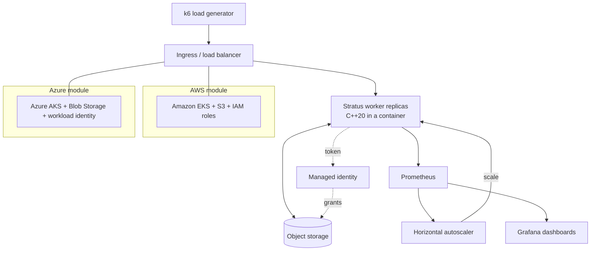

# Stratus

Course project for **Cloud Computing and Technologies**, MEng in Computer and Software
Engineering, Faculty of Computer Systems and Technologies, Technical University of Sofia.

## What it is

Stratus is a compute-intensive HTTP service that gets deployed to Amazon Web Services and
Microsoft Azure at the same time, from a single declarative infrastructure definition. The
same container image, the same workload description and the same autoscaling rule run in
both clouds, so the only thing that differs between the two deployments is the provider
underneath. That makes it possible to measure the difference between the providers instead
of arguing about it: identical synthetic load is driven against both, and latency, scaling
behaviour and cost per unit of work are recorded side by side.

## Goals

- Deploy one workload to AWS and Azure by changing a single variable, with no per-provider
  copy of the application or workload definition.
- Keep the provider-specific surface confined to two infrastructure modules exposing an
  identical interface of inputs and outputs.
- Scale horizontally under synthetic load, driven by a metric the application exports itself.
- Read and write the workload's data in each provider's object storage using managed
  identity, with no long-lived credential anywhere in the repository.
- Measure latency percentiles, scale-out reaction time and cost per unit of work on both
  providers under the conditions recorded in `docs/chapters/05_method.tex`.
- Report the results with the raw measurements attached, so the analysis can be rechecked.

## Technologies

| Technology | Version or standard | Why |
|---|---|---|
| C++ | C++20 | The workload is CPU bound, so latency follows the computation itself; no managed runtime pauses to confound the measurements. |
| CMake | 3.20 or newer | Standard build driver for the worker, reproducible inside the container build. |
| Docker | OCI image, multi-stage build | One image with one digest is deployed to both providers, which is what makes the comparison fair. |
| Kubernetes | managed: Amazon EKS, Azure AKS | The only compute option where the workload description is byte-identical across both providers. |
| Terraform / OpenTofu | 1.6 or newer | Declarative, idempotent, multi-provider: the difference between clouds is localised in two modules. |
| k6 | latest stable | Load scenario lives in a versioned file and reports latency percentiles, not just means. |
| Prometheus | latest stable | Metrics are scraped from the application itself, so the same instrument measures both clouds. |
| Grafana | latest stable | Dashboards for the three experiments, screenshotted into the report. |
| LaTeX | pdfLaTeX, T2A + tempora | Required format for the faculty report, Cyrillic under pdfLaTeX. |

## Architecture

A load generator drives requests at a provider-managed ingress, which fans them out to a
replica set of the C++ worker. The worker reads its input and writes its output to the
provider's object storage, authenticating with a short-lived token obtained through managed
identity rather than a stored key. It also exports metrics, which Prometheus scrapes and the
autoscaler consumes to add or remove replicas. Everything above the dashed boundary is
identical across both clouds; everything below it lives in a per-provider Terraform module
with a fixed interface.



## Build

```bash
# Worker
cmake -S . -B build -DCMAKE_BUILD_TYPE=Release
cmake --build build -j
ctest --test-dir build --output-on-failure

# Container image
docker build -t stratus-worker:local .

# Infrastructure (repeat with -var="provider=azure")
cp .env.example .env        # then fill in your own values, never commit .env
cd infra
terraform init
terraform plan  -var="provider=aws"
terraform apply -var="provider=aws"

# Load test
k6 run load/scenario.js
```

## Documentation

The project report lives in `docs/` and is written in Bulgarian, as the subject is taught in
Bulgarian and the layout is normative for the faculty. Build it with:

```bash
cd docs
latexmk -pdf Main.tex
```

Output lands in `docs/build/Main.pdf`. The formatting follows the TU-Sofia FKST report
format (A4, Times-metric 12pt, 1.5 line spacing, Roman-numbered sections). Unfilled facts
are marked with `\TODO{...}` and can be listed with `grep -rn 'TODO' docs/`.

## Security note

**No credentials are committed to this repository.** No account identifiers, no subscription
IDs, no ARNs, no access keys, no connection strings. Every such value is supplied through an
environment variable; `.env.example` lists the variable names with placeholder values only.
Terraform state and local variable files are gitignored. The worker authenticates to object
storage with a short-lived token from managed identity, so no long-lived secret exists to
leak in the first place.

## Status

- [x] Repository scaffold and report skeleton
- [ ] Compute worker (`src/`, `include/`)
- [ ] Unit tests (`tests/`)
- [ ] Container image
- [ ] AWS infrastructure module (`infra/`)
- [ ] Azure infrastructure module (`infra/`)
- [ ] Autoscaling configuration
- [ ] Load scenario (`load/`)
- [ ] Prometheus and Grafana setup
- [ ] Experiments run and measurements collected
- [ ] Report chapters filled in, all `\TODO` markers resolved

Nothing beyond the scaffold exists yet.

## License

MIT. See [LICENSE](LICENSE).
