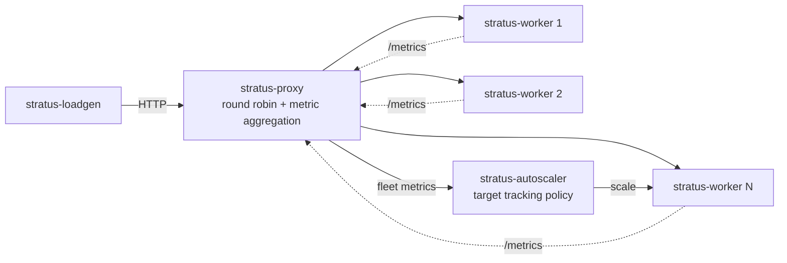

# Stratus

Course project for **Cloud Computing and Technologies**, MEng in Computer and Software
Engineering, Faculty of Computer Systems and Technologies, Technical University of Sofia.

## What it is

Stratus is a compute-intensive HTTP service, a round-robin reverse proxy that also
aggregates the fleet's metrics, a synthetic load generator, and an autoscaling controller
that reads those metrics and changes the number of workers. All four are C++20, build from
one CMake tree with **no third-party dependencies**, and ship in one 8 MB container image.

The infrastructure code targets AWS and Azure from a single shared module interface, so
the same service definition points at either provider by changing one variable.

## Status, stated plainly

| Part | State |
|---|---|
| Compute worker, proxy, load generator, autoscaler, cost model | Built, tested, measured |
| Local docker-compose stack, N workers behind a proxy | **Runs.** Verified |
| Autoscaling under load, end to end | **Runs.** Timeline in `results/` |
| Terraform modules for AWS and Azure | **Written and formatted. Never applied.** |
| Any measurement of AWS or Azure | **Does not exist** |
| Object storage access from the worker | Provisioned by the modules, **not used by the worker binary** |

The workload is purely computational and does not read or write objects. The modules
create the bucket or container and pass its name and the identity to the container through
environment variables, but there is no object-store client in the worker: any storage call
would put network waiting inside a unit of work whose whole point is to be pure compute
with a known cost.

There are no cloud credentials and no `terraform` binary on the machine this was developed
on. Nothing has been deployed to any cloud account, so no latency, scaling or cost figure
for either provider is reported anywhere. Every such cell in the report is left as a
`\TODO` marker. The measurements that do exist are all local, on one machine, and the
report says so.

## Architecture



The proxy discovers replicas by resolving the worker service name: on a container network
the embedded DNS returns one address per running replica, so scaling the service changes
what DNS answers and the proxy follows. No service registry, no config reload.

The autoscaler derives utilisation the way a scraper derives a rate, from the delta of a
monotonic counter:

```
utilisation = Δ(busy_seconds) / (Δt × Σ worker_threads)
```

CPU load is deliberately not used as the signal: the workload saturates a core by design,
so per-core load is near 1.0 whether the fleet is comfortable or drowning.

## Endpoints

| Endpoint | What it does |
|---|---|
| `GET /healthz` | Liveness |
| `GET /work?size=N&iter=M` | One unit of work. `size` 1..4096, `iter` 1..100000. Out of range answers 400, never clamps |
| `GET /metrics` | Prometheus text exposition format |
| `GET /backends` | Proxy only: the replicas it currently resolves |

The unit of work is the Mandelbrot escape-time function on a `size × size` grid with an
`iter` ceiling over a fixed window of the complex plane, so its cost is `O(size² × iter)`
and deterministic. The standard unit used for every measurement is `size=384 iter=500`,
which executes exactly 18,690,064 inner iterations.

## Technologies

| Technology | Version used | Why |
|---|---|---|
| C++ | C++20 | The workload is CPU bound, so latency follows the computation itself; no managed runtime pauses to confound the measurements. |
| CMake | 3.20 or newer | Only build dependency. No package manager, no configure-time fetch. |
| Docker | multi-stage build, `scratch` final stage | One 8.09 MB image carries all five executables. |
| AWS ECS on Fargate | via Terraform | Matches the built topology: a container behind a load balancer with an external scaling policy. |
| Azure Container Apps | via Terraform | The Azure equivalent, same shared module interface. |
| Terraform / OpenTofu | 1.6 or newer | The difference between clouds is localised in two modules. |
| Prometheus text format | 0.0.4 | The *format*, not the program. Any scraper that reads it can read this service. |
| LaTeX | pdfLaTeX, T2A + tempora | Required format for the faculty report, Cyrillic under pdfLaTeX. |

## Build

Verified on Windows 11 with g++ 15.2.0 (MinGW-w64), CMake 4.3.2 and Ninja 1.13.2.

```bash
cmake -S . -B build -G Ninja -DCMAKE_BUILD_TYPE=Release
cmake --build build
ctest --test-dir build --output-on-failure
```

26 test cases, each registered with CTest individually so a failure names the case. The
test runner is a single header in `tests/`, not GoogleTest or Catch2, because the build
must work on a clean machine with nothing fetched.

`-G Ninja` is optional. Without it CMake picks the platform default.

## Run

### The demo, one command

```powershell
powershell -File demo.ps1        # Windows
```

```bash
./demo.sh                        # Linux, macOS
```

It brings the stack up with one worker, starts the controller, drives 40 req/s at a fleet
that cannot absorb it, and prints the scaling timeline with the metric that triggered each
decision. Output also lands in `results/`.

Equivalently, `cmake --build build --target demo`.

### By hand

```bash
docker compose up -d --build --scale worker=2
curl "http://127.0.0.1:8080/work?size=384&iter=500"
curl  http://127.0.0.1:8080/metrics
curl  http://127.0.0.1:8080/backends

./build/stratus-loadgen --host 127.0.0.1 --port 8080 \
    --size 384 --iter 500 --concurrency 8 --rate 0 --duration 20 --warmup 5

./build/stratus-autoscaler --host 127.0.0.1 --port 8080 \
    --min 1 --max 6 --target 0.70 --interval 3 --cooldown-up 6 --cooldown-down 15

docker compose down
```

### Measurements

```powershell
powershell -File bench.ps1
```

Throughput and latency percentiles against worker count (3 repetitions each), plus
scale-out reaction time (5 repetitions). Raw output in `results/`.

### Cost model

Every price is a required input. There is no built-in price anywhere in the source, and
none will be added: prices differ by region, commitment, account and month.

```bash
./build/stratus-cost --price-instance-hour <yours> --instances 2 \
    --throughput 40 --window 3600 --currency EUR
```

### Infrastructure

```bash
cp .env.example .env        # then fill in your own values, never commit .env
cd infra
terraform init
terraform plan -var-file=your.tfvars     # target_provider = "aws" or "azure"
```

**This has never been run.** The modules are written to the documented resource schemas
and formatted. They have not been validated against a live account, and `terraform` is not
installed on the development machine. Treat them as unproven.

## Measured results

All local, on one machine, load generator co-resident with the containers. Medians of
three repetitions:

| Workers | Throughput [req/s] | Speedup | p50 [ms] | p90 [ms] | p99 [ms] |
|--:|--:|--:|--:|--:|--:|
| 1 | 18.90 | 1.00 | 99.25 | 115.88 | 203.35 |
| 2 | 33.45 | 1.77 | 129.18 | 183.66 | 285.80 |
| 4 | 57.95 | 3.07 | 118.35 | 232.10 | 462.00 |
| 6 | 65.10 | 3.44 | 120.22 | 390.38 | 863.21 |

Scaling is sublinear and runs out around 4 workers, on a 12-CPU machine that is also
running the proxy and the load generator. That is a property of the measurement
environment, not of the service, and the report says so rather than quoting the numbers as
a characteristic of the software.

Scale-out reaction time, 1 to 2 replicas, 5 repetitions: median 2.001 s, range 1.357 to
5.234 s.

## Documentation

The project report lives in `docs/`, in Bulgarian, in the TU-Sofia FKST format. Build it
with:

```bash
cd docs
latexmk -pdf Main.tex
```

Output lands in `docs/build/Main.pdf`, which is tracked on purpose. `latexmk` returns 0
even when the bibliography silently fails, so check `docs/build/Main.blg` says
"You've used 12 entries". Unfilled facts are marked `\TODO{...}` and can be listed with
`grep -rn 'TODO' docs/`. The remaining markers are all things that require an actual
deployment.

## Security note

**No credentials are committed to this repository.** No account identifiers, no
subscription IDs, no ARNs, no access keys, no connection strings. Every such value is
supplied through an environment variable or a `.tfvars` file; `.env.example` lists the
variable names with placeholder values only. Terraform state and local variable files are
gitignored.

Both infrastructure modules are written so that no long-lived secret exists to leak: the
AWS task assumes a role scoped to one bucket, and the Azure container app uses a
user-assigned managed identity with the storage account's shared access keys disabled
outright.

## Repository layout

```
include/stratus/   header-only logic: compute kernel, HTTP, metrics, scaling policy, cost
src/               socket layer, HTTP server, and the five main() files
tests/             the test runner and 26 test cases
infra/             root configuration and one module per provider
docs/              the report
results/           raw measurements, committed on purpose
```

## License

MIT. See [LICENSE](LICENSE).
